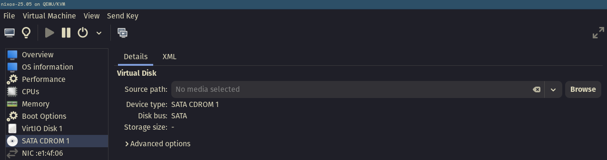
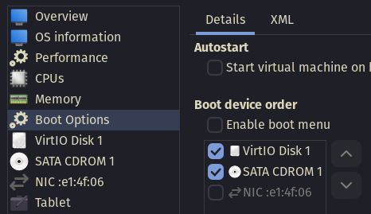

# OtaNix workshop: Setting Up a Home Server Using NixOS

## OtaNix-Server

Progression of the configurations (next inherits previous):

- [Setting up a libvirt VM](./otanix-server/00-initial/)
- [Secret management](./otanix-server/01-secrets/)
<!-- - [`secrets`](./otanix-server/secrets/default.nix): adds sops-nix to manage secrets -->
<!-- - [`02-wireguard`](./otanix-server/02-wireguard/default.nix): using sops-nix to provide the private key, this system sets up a WireGuard VPN -->
<!-- - [`03-nginx`](./otanix-server/03-nginx/default.nix): sets up 03-nginx + self-signed TLS for serving web-based services -->
<!-- - [`04-vaultwarden`](./otanix-server/04-vaultwarden/default.nix): runs 04-vaultwarden behind 03-nginx that's configured to be a TLS-terminating reverse-proxy -->

## Deployment

1. build using `nix-build -A nixosConfigurations.otanix-server-02-wireguard.config.system.build.toplevel` (this creates the symlink `./result`)
1. copy the system using `nix copy --to ssh://root@192.168.122.248 ./result`
1. deploy with `ssh root@192.168.122.248 $(readlink result)/bin/switch-to-configuration switch`

> Also, try [deploy-bs](https://github.com/xhalo32/deploy-bs) (available in `nix-shell`) which does the above steps automatically:
>
> ```sh
> deploy nixosConfigurations.otanix-server-02-wireguard root@192.168.122.248
> ```

## Useful links

- [Search for NixOS options](https://search.nixos.org/options?)
- [sops-nix GitHub](https://github.com/Mic92/sops-nix)

## Troubleshooting

### No bootable devices when starting VM

If you want to boot into the live installer, make sure you have a source path configured (pointing to the installer ISO image) for the CDROM device:



Also make sure to enable the CDROM as a boot option:



After applying and force resetting, you should boot into the installer.

### Unable to start VM

If you get the following error when starting a VM (usually happens after a reboot)

```
Error starting domain: Requested operation is not valid: network 'default' is not active
```

you need to start the default network with

```
virsh -c qemu:///system net-start default
```

> To set the default network to start at boot, run
> ```
> virsh -c qemu:///system net-autostart default
> ```

### SSH key verification failed

The installer generates a new [SSH host key](https://www.ssh.com/academy/ssh/host-key) at boot, so you will likely encounter the following error when trying to SSH in to it after a reboot:

```
$ ssh nixos@192.168.122.215
@@@@@@@@@@@@@@@@@@@@@@@@@@@@@@@@@@@@@@@@@@@@@@@@@@@@@@@@@@@
@    WARNING: REMOTE HOST IDENTIFICATION HAS CHANGED!     @
@@@@@@@@@@@@@@@@@@@@@@@@@@@@@@@@@@@@@@@@@@@@@@@@@@@@@@@@@@@
```

This is easily fixed by removing the host from "known hosts":

```
ssh-keygen -R 192.168.122.215
```